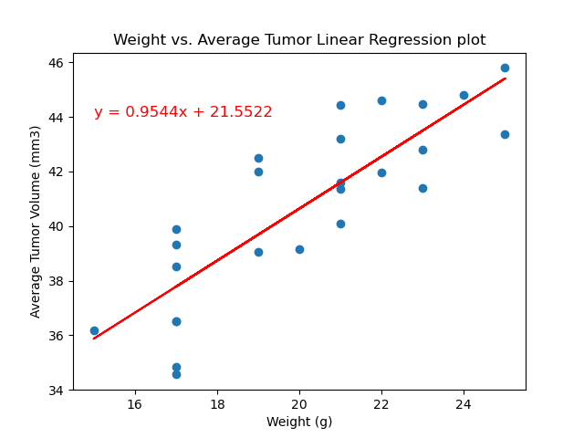

# Matplotlib Challenge
In this assignment, you’ll apply what you've learned about Matplotlib to a real-world situation and dataset.

## Project Overview
You've just joined Pymaceuticals, Inc., a new pharmaceutical company that specializes in anti-cancer medications. Recently, it began screening for potential treatments for squamous cell carcinoma (SCC), a commonly occurring form of skin cancer.

As a senior data analyst at the company, you've been given access to the complete data from their most recent animal study. In this study, 249 mice who were identified with SCC tumors received treatment with a range of drug regimens. Over the course of 45 days, tumor development was observed and measured. The purpose of this study was to compare the performance of Pymaceuticals’ drug of interest, Capomulin, against the other treatment regimens.

The executive team has tasked you with generating all of the tables and figures needed for the technical report of the clinical study. They have also asked you for a top-level summary of the study results.

## Instructions
This assignment is broken down into the following tasks:

- Prepare the data.
- Generate summary statistics.
- Create bar charts and pie charts.
- Calculate quartiles, find outliers, and create a box plot.
- Create a line plot and a scatter plot.
- Calculate correlation and regression.
- Submit your final analysis.

Datasets are included in the Resources folder.

## Analysis
- The analysis started off by merging the study results and the mouse data into 
one dataset, then we cleaned the dataset by removing duplicates.
- Then I made statistical summary by calculating the mean,median,average,varinace,standard deviation and standard error of mean of our dataframe. This gave me a good idea of how and where my data is distributed.
- this further helped me calculate the quartiles for the four most promising drug regimens, which in turn helped me plot a boxplot to view the outliers,median,mean of all four drugs for each mice and their final tumor volume.

- The following is the linear regression between the final tumor volume and weight of the mouse for the drug Capomulin.
- the correaltion coefficient calculates is 0.84 

There are some other visuallizations that are included like the distribution between male and female mouse and drug regimen vs their timepoints.
## Credits
Ask BCS helped with debugging the code. My tutor helped me refine the Readme.